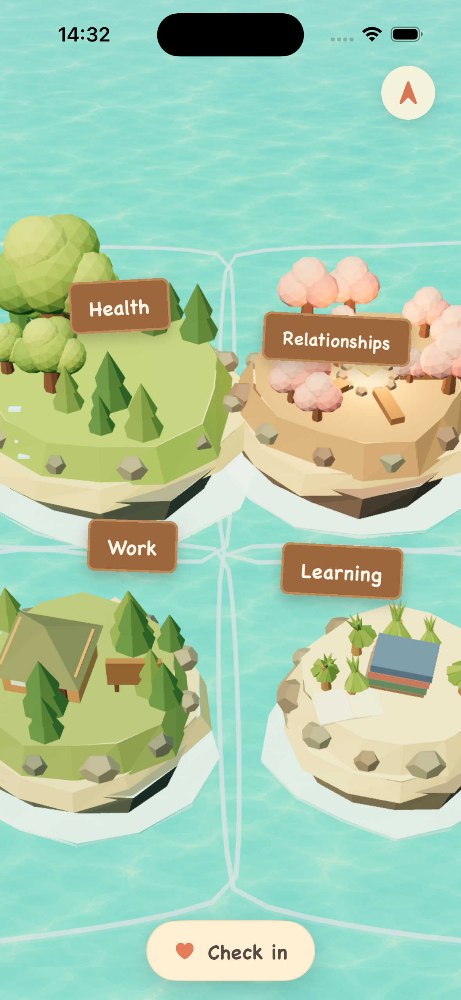

# Mindland Islands

Mindland is an AI-powered iPhone app that turns a person's goals and daily actions into a living map of islands. Supportive activity grows an island and adds contextual details. Repeated harmful patterns slowly become visible rocks, so the map reflects both progress and neglect without punishing a single bad day.

Built for [OpenAI Build Week](https://openai.devpost.com) in the **Apps for Your Life** category.



## The experience

During onboarding, GPT-5.6 Luna has a calm, adaptive conversation with the user. It discovers the areas that genuinely matter to them, creates only those islands, and generates a tailored questionnaire for each one.

Afterward, the user can check in through normal AI chat or an island-specific questionnaire. Both paths preserve the user's original words, turn the day into structured activity records, and update the same island history. The first positive points expand the shoreline; later points add details such as trees, paths, and buildings. Five accumulated negative points create one visible rock. Summary and History views explain what each island represents and how it changed.

The map is a native, explorable 3D lagoon. It supports pan, focal pinch zoom, island focus, double-tap home, dynamic territory layouts, and Liquid Glass conversations over the live world.

## Judge testing

The submitted TestFlight build is the easiest testing path. No shared credentials are required: create an account with email/password, enter Clerk's development verification code when prompted, and complete the onboarding interview. Apple sign-in is also included, though its availability depends on the Apple account and TestFlight environment.

For a quick demo, describe three goals during onboarding, create the map, open **Check in**, and submit several supportive activities for one island. The hackathon build allows up to twelve positive points per island in one day so land growth and new props can be demonstrated in one session. Focus an island and open its book control to inspect Summary and History.

The TestFlight public link will be added here as soon as Apple finishes processing the submitted build.

## Run locally

Mindland targets iOS and uses native modules, including WebGPU and Liquid Glass. Use an Expo development build on macOS with Xcode; Expo Go cannot run this project.

Requirements: Node.js 22 or newer, npm, Xcode, an iOS Simulator, a Clerk application, a Convex project, and an OpenAI API key.

```bash
npm install
cp .env.example .env.local
npx convex dev
npx expo run:ios
```

Put your Clerk publishable key and Convex deployment URL in `.env.local`:

```dotenv
EXPO_PUBLIC_CLERK_PUBLISHABLE_KEY=pk_test_...
EXPO_PUBLIC_CONVEX_URL=https://your-deployment.convex.cloud
```

Configure these server-only variables in the Convex dashboard or CLI. Never place them in an `EXPO_PUBLIC_` variable:

```text
OPENAI_API_KEY
CLERK_JWT_ISSUER_DOMAIN
```

In Clerk, enable email/password authentication and create a Convex JWT template or otherwise configure Convex to trust the Clerk issuer used by `convex/auth.config.ts`. Apple sign-in additionally requires an Apple Developer team and the Sign in with Apple capability for your own bundle identifier.

The repository carries a narrow `patch-package` compatibility patch for Expo 57 on the Xcode version used during Build Week. `npm install` applies it automatically.

## Verification

```bash
npx tsc --noEmit
node --test tests/*.test.ts
```

The current suite contains 117 tests covering island discovery, questionnaire generation, daily activity merging, privacy boundaries, map layout and gestures, growth, rocks, sinking, resurfacing, recent-check-in context, and renderer lifecycle rules. The complete account → onboarding → map → questionnaire → growth → history loop was also exercised in the native iOS simulator with real Clerk, Convex, and GPT-5.6 calls.

## Architecture

The app keeps the product rules separate from the 3D renderer:

```text
Expo / React Native UI
        │
        ├── Clerk session and native account flows
        │
        ├── Convex queries, mutations, and streaming actions
        │       └── GPT-5.6 Luna interview and interpretation
        │
        └── Plain island domain state
                └── deterministic WebGPU / Three.js lagoon renderer
```

Convex owns persistent user data and verifies the Clerk identity on the server. Every island, activity, conversation, questionnaire, and history query is scoped to that identity. GPT-5.6 output is validated before it becomes domain data, while the original user message remains available for history and explanation.

The product decisions and their reasoning live in [`docs/adr`](docs/adr). The current build plan and completed work live in [`docs/phases/phase-1-initial-loop`](docs/phases/phase-1-initial-loop). A plain-language architecture review is available in [`docs/architecture/2026-07-18-readable-architecture-review.md`](docs/architecture/2026-07-18-readable-architecture-review.md).

## How Codex and GPT-5.6 were used

Codex was the main engineering collaborator throughout Build Week. We first used it as a product partner to turn the island metaphor into explicit rules: how onboarding discovers islands, how overlap works, when land grows, how rocks accumulate, and how a sunken island resurfaces. Those choices were recorded as ADRs before or while they were implemented.

Codex then planned and built the Expo app, Convex backend, Clerk authentication, Apple developer integration, WebGPU world, native Liquid Glass UI, camera gestures, AI conversations, generated questionnaires, growth system, and history views. It ran focused implementation tasks, kept the local documentation current, tested privacy with separate accounts, exercised the iOS simulator, and used screen recordings to diagnose animation and full-flow problems. One autonomous session continued for roughly five hours while the creator slept.

GPT-5.6 Sol powered the core Codex engineering work. GPT-5.6 Luna powers Mindland itself at low reasoning: it conducts onboarding and daily conversations, estimates interview progress, discovers islands, generates island-specific questionnaires, interprets activity into validated structured data, and selects context-fitting visual details from a bounded catalogue. Deterministic fallbacks keep the main loop usable if a model response fails validation.

Key human decisions remained explicit: the creator defined the product metaphor, visual direction, daily scoring rules, five-negative-points-per-rock algorithm, island survival rule, information architecture, and acceptance criteria, then reviewed the app repeatedly in the simulator.

## Stack

Expo 57, React Native 0.86, TypeScript, NativeWind 5, Expo Liquid Glass, React Native WebGPU, Three.js, Convex, Clerk, Vercel AI SDK, and OpenAI GPT-5.6.

## License

[MIT](LICENSE)
